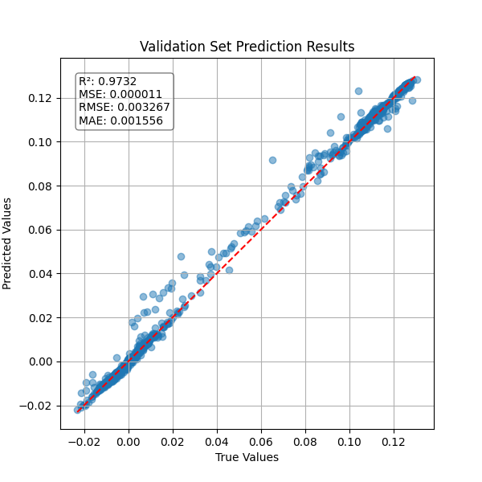
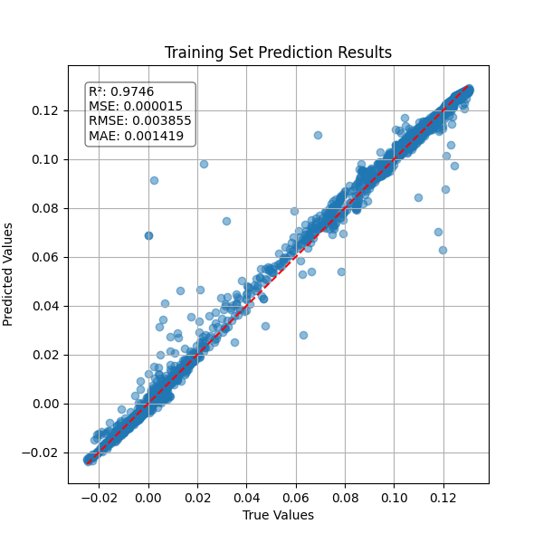
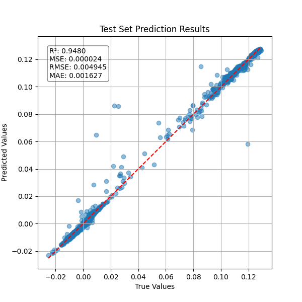
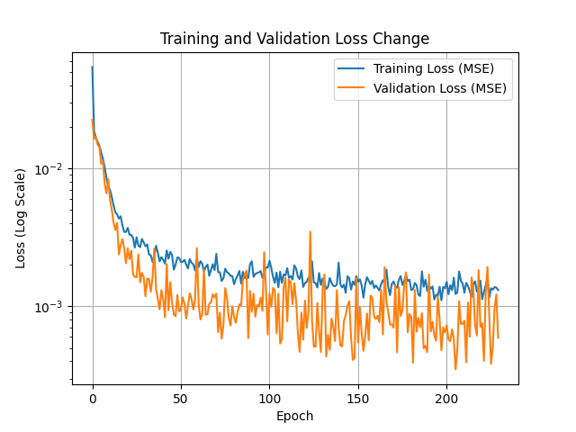

# Neural Network Regression for Predicting U and V

This project builds and trains a neural network using TensorFlow to predict the values of `U` and `V` from input variables `x` and `y`. It applies polynomial feature engineering, data normalization, and evaluates performance using regression metrics.

## Features

- Reads data from `Data.xlsx` and generates polynomial features: `x²`, `y²`, and `xy`.
- Splits dataset into training, validation, and test sets.
- Normalizes input and output using `MinMaxScaler`.
- Uses a deep neural network with dropout and LeakyReLU activations.
- Trains using MSE loss and evaluates with R², MSE, RMSE, MAE.
- Saves predictions and plots to files.

## Outputs

- 📉 `loss_plot.png`: Training and validation loss over epochs (log scale).  
- 🔵 `train_scatter.png`: Scatter plot of true vs. predicted on training set.  
- 🟠 `val_scatter.png`: Scatter plot for validation set.  
- 🟢 `test_scatter.png`: Scatter plot for test set.  
- 📊 `prediction.xlsx`: Excel file containing true and predicted U, V values.  
- 💾 `model.keras`: Saved Keras model.

## Plots

| Validation | Training |
|--------------------|--------------------|
| |  |

| Test | Training Loss Plot |
|------------|------|
|  |  |

---

**Author:** Muhammed T. ([@2mdtln](https://github.com/2mdtln))  
**Date:** 2025-05-18