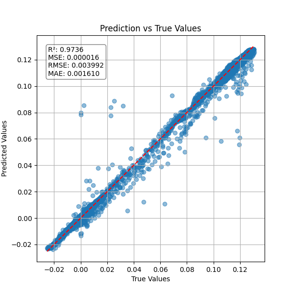
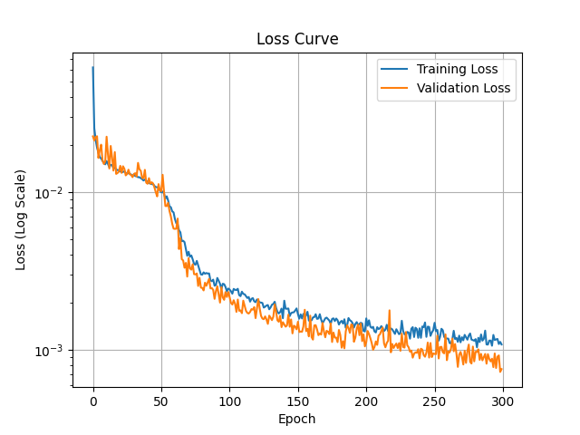

# Neural Network Regression for Predicting U and V

This project builds and trains a neural network using TensorFlow to predict the values of `U` and `V` from input variables `x` and `y`.

## Files

- `train.py` — Loads and preprocesses data, trains the model, saves predictions and training plot.
- `test.py` — Loads the saved model, evaluates performance, and generates a scatter plot comparing predicted and actual values.
- `Data.xlsx` — Input data file (must contain columns: `x`, `y`, `U`, `V`).

## Outputs

- `final_model.keras` — Saved trained model.
- `final_prediction.xlsx` — Predicted values on training data.
- `final_loss_plot.png` — Log-scaled loss plot during training.
- `test_predictions.xlsx` — Model predictions and ground truth comparison.
- `test_scatter.png` — Scatter plot of true vs predicted values.
- Terminal output of R², MSE, RMSE, and MAE.

## Plots

| Test | Training Loss Plot |
|------------|------|
|  |  |

---

**Author:** Muhammed T. ([@2mdtln](https://github.com/2mdtln))  
**Date:** 2025-05-18

## License

This project is licensed under the [MIT License](LICENSE).